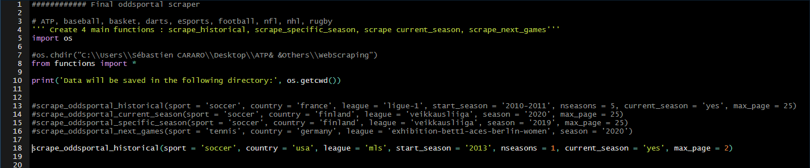
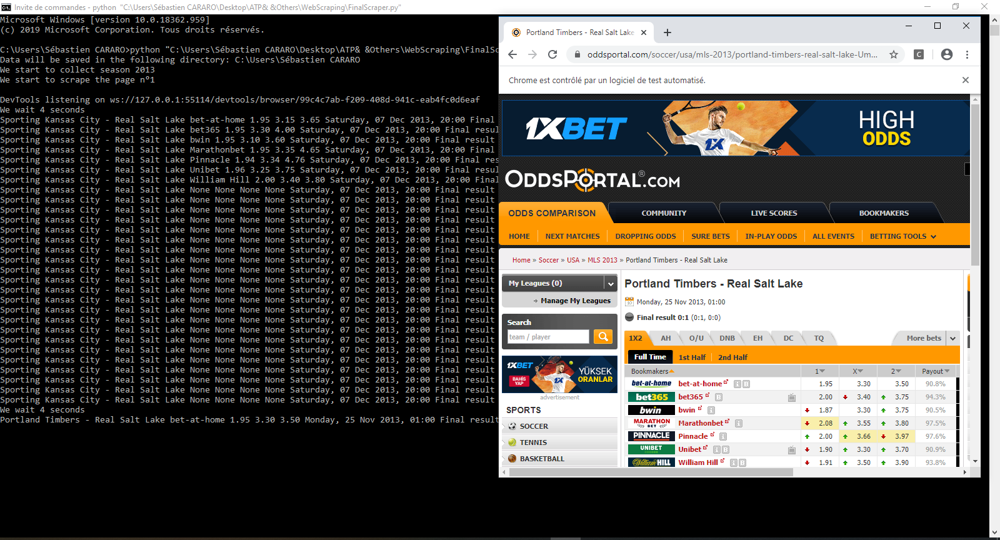
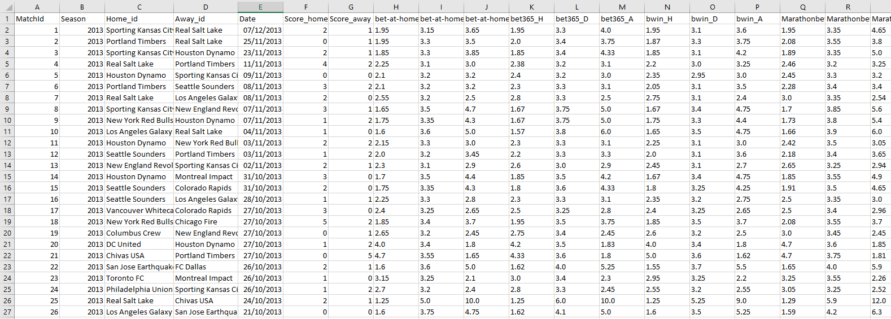

# scrapeOP
--------------------------------------------------------------------------------------------------------------------------------------------------------------------------------
----------------------------------------------------------------------------------------------------------------------------------------------------------------------------------------------------------------------------------------------------------------------------------------------------------------------------------------------------------------
:new::new::new: A python package for scraping oddsportal.com :new::new::new: <br/>
------------------------------------------------------------------------------------------------------------------------------------------------------------------------------------------------------------------------------------------------------------------------------------------------------------------------------------------------------------------------------------------------------------------------------------------------------------------------------------------------------------------------------------------------

:information_source: Oddportal.com [1] is a tremendous website containing both historical and future betting odds concerning a wide range of sports and boomakers. <br />
This repository contains : <br /> 
1. A set of functions to scrape whatever league you wish : 
    1. Clone the repository or download it 
    2. Set your chrome driver location at line 20 in *functions.py*. NB : path is written with double slashes
    2. Open *FinalScraper.py* and use one of the functions to scrape, that is as simple as this!

:information_source: Functionalities :
- Multiple sports supported : soccer, basketball, esports, darts, tennis, baseball, rugby, american football, hockey [list to be expanded soon!]
- Mutiple functionalities : collect historical odds, current season only, upcoming games, specific season only
- Collects all available bookmakers odds for each game
- Collects the final result
- Automatically sort the data by date 
- 14/11/2020 : You can now have the possibility to scrape the opening odds instead of the closing odds. To do this, just change the line 26 in *functions.py* to 'OPENING'<br />

:information_source: Currently supported : <br />
Sport | Historical data (multiple seasons) | Current Season only | Specific Season | Next Games 
------------ | ------------- | ------------ | ------------- | -------------
American Football | :heavy_check_mark: | :heavy_check_mark: | :heavy_check_mark: | :heavy_check_mark:
Baseball | :heavy_check_mark: | :heavy_check_mark: | :heavy_check_mark: | :heavy_check_mark:
Basketball | :heavy_check_mark: | :heavy_check_mark: | :heavy_check_mark: | :heavy_check_mark:
Darts | :heavy_check_mark: | :heavy_check_mark: | :heavy_check_mark: | :heavy_check_mark:
eSports | :heavy_check_mark: | :heavy_check_mark: | :heavy_check_mark: | :heavy_check_mark:
Handball | :heavy_check_mark: | :heavy_check_mark: | :heavy_check_mark: | :heavy_check_mark:
Hockey | :heavy_check_mark: | :heavy_check_mark: | :heavy_check_mark: | :heavy_multiplication_x:
Rugby | :heavy_check_mark: | :heavy_check_mark: | :heavy_check_mark: | :heavy_check_mark:
Soccer | :heavy_check_mark: | :heavy_check_mark: | :heavy_check_mark: | :heavy_check_mark:
Tennis | :heavy_multiplication_x: | :heavy_check_mark: | :heavy_multiplication_x: | :heavy_check_mark:
Volleyball | :heavy_check_mark: | :heavy_check_mark: | :heavy_check_mark: | :heavy_check_mark:

:information_source: The main functions which you can use are the following one : <br />
```python
1.scrape_oddsportal_historical(sport = 'soccer', country = 'france', league = 'ligue-1', start_season = '2010-2011', nseasons = 5, current_season = 'yes', max_page = 25)
2.scrape_oddsportal_current_season(sport = 'soccer', country = 'finland', league = 'veikkausliiga', season = '2020', max_page = 25)
3.scrape_oddsportal_specific_season(sport = 'soccer', country = 'finland', league = 'veikkausliiga', season = '2019', max_page = 25)
4.scrape_oddsportal_next_games(sport = 'tennis', country = 'germany', league = 'exhibition-bett1-aces-berlin-women', season = '2020') 
```
:information_source: *e.g.* if I want to collect the data concerning the **soccer** league **MLS (USA)** during the **2013 season (1 season)** and for the **current season aswell** and that I only want the **first two pages** from oddsportal, I just need to call : <br/>

..then console when running code : <br/>

..and finally the scraped data, saved in .csv format : <br/>
 <br/>

Extra-documentation can be found for the functions in the *functions.py* script. :100::100: <br/><br/>

:information_source: How to create a sports-betting algorithm from historical data : </br>
- Medium article : https://medium.com/analytics-vidhya/how-covid-19-prevented-me-from-being-a-millionnaire-in-2020-5b2144e8bdef </br>
- Full paper : https://seb943.github.io/Data/Paper_Exploiting_bookmakers_biases.pdf </br> </br>

:information_source: Please report any bug/issue in the *issues* section or directly at sebcararo@hotmail.fr. Any feedback is really appreciated :speech_balloon: :+1:. </br>


------------------------------------------------------------------------------------------------------------------------------------------------------------------------------
------------------------------------------------------------------------------------------------------------------------------------------------------------------------------
------------------------------------------------------------------------------------------------------------------------------------------------------------------------------
------------------------------------------------------------------------------------------------------------------------------------------------------------------------------
You can also have a look at the *functions.py* source code in order to understand the mechanics and eventually adapt the code to your own purpose. In the *functions.py* script, I distinguished 4 types of sports, according to the sport-related format of outcome (either 1X2, 12, and various types of score : tennis-alike, football-alike, baseball-alike, hockey-like (the format is different for hockey on oddsportal website) ). <br />

With the emergence of sports analytics and machine learning, it has become possible for anyone to create data-based betting strategies, taking into considerations both market-related figures (odds values, variations, differentials between bookmakers) and sport-related metrics of performance of any team. In order to perform this task, the very minimal data required is the historical results and betting odds (closing odds are usually preferred) which you can then use to create Machine Learning and Deep Learning models to infer probabilities of victories, and to analyze whether any given team is being undervalued or overvalued by any given bookmaker. The oddsportal website is one of the largest publicly open odds database, however its format and architecture are not very pleasing to deal with, therefore one need a bit of time to build tools to collect the data on their website. This package offers a comprehensive interface (sort of unofficial API) to collect odds and save the data into a comprehensive csv format. <br />

[1] https://www.oddsportal.com/ <br />

NB : This package is purposed for educational use only, not for any commmercial purpose in any way. I am not related by any mean with the oddsportal website. <br/>

BTC : 3PkoHLXmXsL8kBrFu7GQ8kpmzPBmNK6m8B <br/>
ETH : 0xFdbB5aF291cB7e711D62c1E4a8B58d0EbD423F9C

